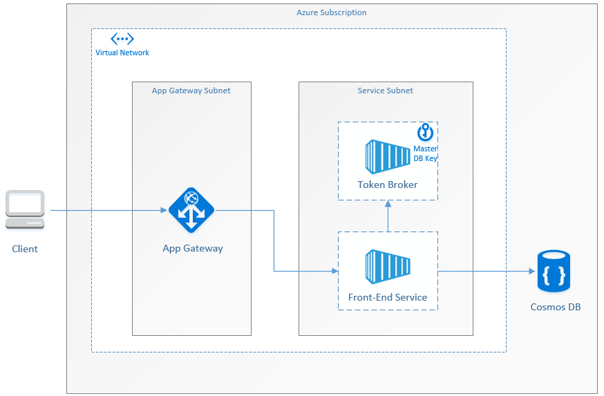

## Problem Being Solved
A multi-tenant service should have at least have these attributes:

1. Tenant data isolation
   - Prevents and limits exposure of other tenant's data to attacker.
2. Time bound access
   - Prevents unlimited access to tenant data.
3. Least Privilege Principle
   - A compromised service should limit what an attacker can do by having the least possible permissions.

One of the primary concerns is regarding data store injection attacks, such as SQL Injection-style attacks. In these 
type of attacks it is common for a caller to try and invoke an operation in the context of a specific role or tenant 
(for which it does have access), but will purposefully maliciously affect other data in the same data store or reveal 
other tenant’s data.

Another concern is what occurs when the multi-tenant service is compromised by a malicious attacker.  For example 
perhaps there is a “root admin” role for the multi-tenant service, and the credentials for that role have been revealed. 
In this scenario if the multi-tenant service itself doesn’t actually have its own inherit access to the data store then 
being a root admin would not actually grant the attacker full access to the entire data store either.

To satisfy these requirements, you can leverage Azure’s Cosmos DB as the data store and also use their Resource Token 
functionality (https://docs.microsoft.com/en-us/azure/cosmos-db/secure-access-to-data#resource-tokens) to add better 
tenant isolation.

## Description

Create a Token Broker service which is isolated from the internet and which allows ingress only from our other services. 
This Token Broker service will act as a gatekeeper to the data store, and any service wishing to access the data store 
must first get permission from the Token Broker. The Token Broker service has access to the master key of the Cosmos DB.  
The master key can optionally be further secured, such as for example using Azure Key Vault to secure it in a hardware 
security module.  

It is assumed that the CosmosDB collection is structured in such a way that every data of interest is associated with a 
specific tenant.  The easiest thing to do is to create a partition per tenant, but that isn’t technically a requirement.  
The Token Broker service has a sole duty: to expose a single API endpoint that other services can call which returns 
Resource Tokens for the requested data access, but only once it has validated that the caller is allowed to access the 
requested data.

The services which need to access the CosmosDB will therefore have to make an additional network call, to the Token 
Broker service, in order to get a Resource Token before they can actually do the DB operation.  Since these services 
can be co-located next to each other, for example within the same vNet, the overhead of the extra network call is seen 
as minimal.

## Data Flow
It’s assumed that the user, who belongs to a tenant, has already authenticated to our front-end service (and this is not 
covered here).  The tenant user requests the front-end service to perform a task that requires access to the tenant's 
data in the Cosmos DB.  The front-end service will make a call to the Token Broker service and ask it to generate a 
resource token for access to just that tenant’s data.  The request to the Token Broker service contains the caller’s 
authentication token (which includes the TenantID), the identifier for the record or partition being accessed, and the 
type of access being requested (read, write, etc…).  Note that the front-end service will make the request to the Token 
Broker service as the tenant, using the same authentication token that the tenant used to authenticate to the front-end 
service.

The Token Broker service first verifies the caller’s identity by checking their authentication token.  This can be done 
efficiently if the authentication token encapsulates some information about the user and the tenant they belong to.  If 
you’re using something like JSON Web Tokens (https://jwt.io/) then it’s possible to do this validation without having to 
make another network call to an Identity Provider (or intermediary auth service).  

After the Token Broker service has verified the identity’s caller it will compare the requested data versus what the 
caller is allowed to access.  In particular if the data is partitioned according to tenantID then this is 
straightforward: just compare the TenantID in the auth token with the tenant ID of the requested partition.  If the 
Token Broker service confirms that the caller has access then it creates a Resource Token and also sets the duration for 
which the token will be valid.  This can also be done all in-process 
(https://github.com/Azure/azure-cosmos-dotnet-v2/blob/master/samples/rest-from-.net/Program.cs), without having to make 
another network call, if you use Master Key Signatures instead of Resource Tokens.

This Resource Token (or Master Key Signature) is then returned back to the front-end service.

The front-end service now creates a CosmosDB connection using the Resource Token generated by the Token Broker service 
and makes a request to access the tenant’s data.  Cosmos DB then validates the presented Resource Token and if valid it 
then retrieves or updates the tenant’s data as requested by the front-end service.
